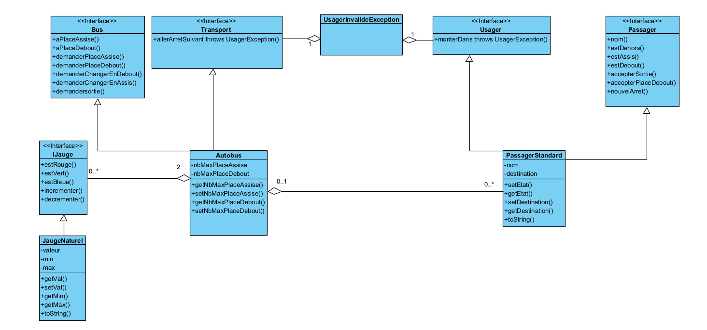

# 🚌 TDD Project L3 - Simulation de Transport en Commun

*(Remplacez `header-tdd.png` par le nom de l'image que vous avez générée précédemment)*

## 📋 Description du Projet

Ce projet est une application Java développée dans le cadre d'un module universitaire de **Licence 3**. Il simule la gestion d'un système de transport en commun (Autobus) et des interactions avec différents types de passagers.

L'objectif principal de ce projet n'est pas seulement le résultat fonctionnel, mais surtout l'application rigoureuse de la méthodologie **TDD (Test Driven Development)**.

## 📐 Conception & Architecture

L'architecture du projet repose sur un découplage fort entre l'abstraction (Interfaces) et l'implémentation. Voici le diagramme de classes illustrant les relations entre le `Bus`, les `Passager`, et les différents états.

### Concepts clés mis en œuvre :
* **Interfaces (`IJauge`, `IEtatPassager`)** : Pour garantir la flexibilité et faciliter les tests.
* **Mocking** : Utilisation de "Faux" objets (`FauxBusVide`, `FauxPassager`) pour tester les composants de manière isolée.
* **Machine à états** : Gestion des transitions des passagers (Assis, Debout, Dehors) via la classe `EtatPassager`.

## 🛠️ Méthodologie

Le développement a suivi le cycle **Red-Green-Refactor** :
1.  **Red** : Écriture d'un test unitaire qui échoue.
2.  **Green** : Écriture du code minimum pour faire passer le test.
3.  **Refactor** : Amélioration de la structure du code.

## 📂 Structure du Projet

Le projet est découpé en plusieurs itérations (packages ou dossiers sources) montrant l'évolution du code :

* **partie.0** : Prise en main et concept de Jauge.
* **partie.1** : Gestion des états des passagers.
* **partie.2** : Interactions Bus / Passager.
* **partie.3 & partie.4** : Gestion des exceptions (`UsagerInvalideException`) et finalisation.

## 💻 Installation et Exécution sous Eclipse

Ce projet est conçu pour être exécuté dans un IDE comme **Eclipse**.

### 1. Importation du projet
1.  Ouvrez Eclipse.
2.  Allez dans **File** > **Open Projects from File System...**
3.  Cliquez sur **Directory** et sélectionnez le dossier racine du projet (`tdd-project-l3`).
4.  Sélectionnez les dossiers des parties (ex: `partie.4`) et cliquez sur **Finish**.

### 2. Lancer les Tests Unitaires (JUnit)
Puisque le projet est piloté par les tests, c'est la manière principale d'exécuter le code.

1.  Dans l'explorateur de projet (Package Explorer), faites un **clic droit** sur le dossier `src` (ou sur un package spécifique comme `tec`).
2.  Sélectionnez **Run As** > **JUnit Test**.
3.  La vue **JUnit** s'ouvrira :
    * 🟢 **Barre Verte** : Tous les tests passent. Le code est fonctionnel.
    * 🔴 **Barre Rouge** : Un ou plusieurs tests échouent. Il faut corriger le code.

## 🌟 Fonctionnalités Principales

* **Gestion de la capacité** : Le bus respecte une jauge maximale (assis/debout).
* **Demandes d'arrêt** : Les passagers peuvent signaler leur volonté de descendre.
* **Mouvements dynamiques** : Les passagers changent d'état (monter, s'asseoir, se lever, descendre) en respectant les contraintes logiques du bus.

## 👤 Auteur

Ce projet a été réalisé par **[Assane KANE]** dans le cadre de la formation **Licence 3 Informatique**.

---
*Ce README démontre l'application des principes de développement logiciel agile et de l'ingénierie de test.*
